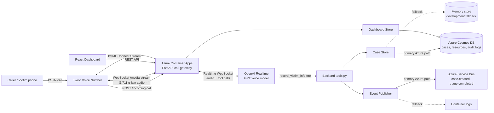
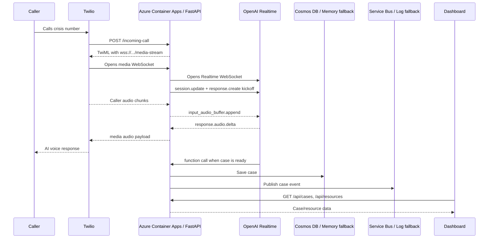
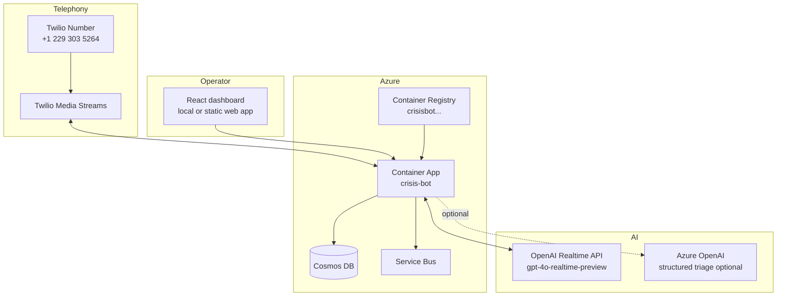

# AI Crisis Management System

> Azure-first crisis voice operations platform for Thailand that accepts emergency calls, performs AI-assisted triage, stores auditable case records, and helps operators coordinate response.

## Overview

The current prototype is a voice-based crisis management system for floods, fires, earthquakes, medical emergencies, and public-safety incidents. The improved target solution is **Azure Crisis VoiceOps Thailand**: an Azure-centered architecture that keeps voice calling as the primary intake channel while adding cloud-native case workflow, monitoring, security, maps, and Responsible AI controls.

The recommended migration path is incremental. Keep Twilio for voice intake during the MVP if it is already stable, then move the backend, AI triage, database, dashboard, event workflow, monitoring, and secrets management to Azure.

## Why Voice Matters In Thailand

Thailand has several emergency and public-service hotlines, including 191, 1669, 199, 1155, 1784, and 1555. Voice calling remains important because it works for feature phones and smartphones, supports citizens without data access, helps elderly and vulnerable communities, and allows callers to describe rapidly changing danger in real time.

Voice calling is especially useful for:

- Emergency intake and smart routing
- Medical dispatch and ambulance triage
- Flood rescue and trapped-person reporting
- Tourist and migrant-worker multilingual support
- Welfare checks after a crisis report
- Mass outbound warnings and post-alert escalation
- Coordination between rescue teams, hospitals, local authorities, and command centers

## Target Azure Architecture

```text
Victim phone call
  -> Azure Communication Services or Twilio
  -> Azure Container Apps: FastAPI Call Gateway
  -> Azure AI Speech + Azure OpenAI / Azure OpenAI Realtime API
  -> Azure Service Bus + Event Grid
  -> Azure Functions: triage, pulse checks, notifications, escalation
  -> Azure Cosmos DB for NoSQL
  -> React dashboard on Azure Static Web Apps
  -> Azure Maps + Azure SignalR Service
  -> Azure Monitor + Application Insights + Key Vault
```

## System Visualization Flow

The current deployed MVP uses Twilio for PSTN voice intake, Azure Container Apps for the FastAPI voice gateway, OpenAI Realtime for low-latency speech-to-speech, and Azure-ready storage/event services for crisis operations.



### Runtime Call Flow



### Deployed Component Map



### Architecture Principles

- Use Azure as the operational backbone for database, event queues, dashboard hosting, monitoring, maps, secrets, and AI services.
- Keep voice provider flexible. Azure Communication Services is the preferred Azure-native option, while Twilio can remain during the MVP if number support or streaming is easier.
- Separate real-time call handling from background workflows using Service Bus, Event Grid, and Functions.
- Keep humans in the loop for high-risk or uncertain triage.
- Store AI decisions, extracted facts, human overrides, and triage changes in audit logs.

## Azure Service Mapping

| Module | Current / baseline | Azure recommendation | Purpose |
| --- | --- | --- | --- |
| Voice hotline | Twilio voice/media streams | Azure Communication Services Call Automation, or Twilio for MVP | Inbound calls, callback, IVR, recordings, SMS follow-up |
| Speech | GPT Realtime audio or provider transcription | Azure AI Speech STT/TTS | Thai/English transcription, auditable speech pipeline, multilingual voice prompts |
| AI conversation | OpenAI GPT Realtime | Azure OpenAI Realtime API or Azure AI Speech + Azure OpenAI | Low-latency conversation and controllable triage workflow |
| Triage | LLM + app logic | Azure OpenAI + deterministic safety rules | Structured extraction, severity reasoning, human review |
| Backend | FastAPI/Docker | Azure Container Apps | Serverless container hosting and independent scaling |
| Database | Firestore | Azure Cosmos DB for NoSQL | JSON case records and low-latency dashboard reads |
| Events | Direct DB writes | Azure Service Bus + Event Grid | Reliable crisis workflow processing |
| Pulse checks | App scheduler | Azure Functions / Durable Functions | Scheduled callbacks, retries, escalation |
| Dashboard | React/Firebase | Azure Static Web Apps + Azure SignalR Service | Live operator dashboard |
| Maps | Basic/manual location | Azure Maps | Geocoding, incident pins, routing, nearby hospitals/shelters |
| Knowledge base | Hardcoded survival guide | Azure AI Search + RAG | Grounded safety guidance from official SOPs |
| Monitoring | Basic logs | Azure Monitor + Application Insights | Reliability, latency, errors, call and triage observability |
| Secrets | Environment variables | Azure Key Vault + Managed Identity | Safer credential handling |
| Edge security | None/basic | Azure API Management + Front Door/WAF | Rate limiting, authentication, edge protection |

## MVP Demo Scope

Project name: **Azure Crisis VoiceOps Thailand**

Core demo flow:

1. A victim calls the crisis hotline.
2. The AI detects Thai speech and transcribes the call.
3. The system extracts emergency facts: incident type, location, injuries, people affected, immediate needs, callback number, and urgency.
4. Azure OpenAI assigns a triage recommendation with an explanation and confidence score.
5. Safety rules mark RED and uncertain cases for human review.
6. The case is saved to Cosmos DB and published as a crisis event.
7. The dashboard shows the case, SLA timer, audit trail, and Azure Maps incident pin.
8. Azure Functions schedule pulse checks and escalation workflows.
9. The AI provides immediate safety guidance while the operator coordinates rescue.

Example Thai flood scenario:

```text
Caller: น้ำท่วมอยู่ที่หาดใหญ่ มีคนแก่หายใจลำบาก ติดอยู่ชั้นสอง
Detected: flood + medical risk + trapped elderly person
Triage: RED
Action: alert operator, start SLA timer, schedule pulse check, show location on map
```

## Triage System

Cases are prioritized into three levels:

| Priority | SLA | Criteria | Examples |
| --- | --- | --- | --- |
| RED | <= 10 min | Life threatening or urgent medical support needed | Trapped person, severe bleeding, breathing difficulty, heart attack |
| YELLOW | <= 30 min | Injured or at risk, but not immediately critical | Broken bone, minor bleeding, stable but sick |
| GREEN | When available | Safe, needs information or non-urgent help | Property damage, shelter information, status update |

Automatic pulse checks should run every 1 hour after the last human contact unless a case-specific plan overrides it.

## Structured Triage Output

```json
{
  "case_id": "TH-FLOOD-000123",
  "language": "th",
  "incident_type": "flood",
  "triage_level": "RED",
  "confidence": 0.87,
  "location_text": "Hat Yai, near hospital",
  "injuries": "elderly person breathing difficulty",
  "people_affected": 3,
  "immediate_needs": ["rescue", "medical"],
  "ai_summary": "Caller is trapped in floodwater with an elderly person having breathing difficulty.",
  "human_review_required": true,
  "triage_reason": "Trapped caller plus breathing difficulty indicates immediate life risk."
}
```

## Cosmos DB Data Model

Recommended collections:

- `cases`: primary case record, status, SLA, triage level, assigned operator
- `victims`: caller/victim details and contact preferences
- `calls`: call metadata, provider IDs, timestamps, recordings, callback attempts
- `transcripts`: STT output, language, confidence, redacted text
- `triage_events`: AI recommendations, safety-rule outputs, human overrides
- `pulse_checks`: scheduled checks, outcomes, retries, escalation status
- `resources`: rescue teams, shelters, hospitals, vehicles, supplies
- `audit_logs`: AI decisions, human actions, access events, data changes

Use `case_id` as the main operational identifier and partition high-volume collections by `case_id`, `district`, or `status` depending on query patterns.

## Project Structure

```text
crisis-voiceops-with-azure/
├── README.md
├── docs/
│   └── AZURE_SOLUTION.md
└── crisis-bot/
    ├── main.py
    ├── config.py
    ├── routes.py
    ├── tools.py
    ├── requirements.txt
    ├── Dockerfile
    ├── CRISIS_BOT_SPEC.md
    ├── IMPLEMENTATION.md
    ├── services/
    │   ├── openai_realtime_service.py
    │   ├── twilio_service.py
    │   └── firestore_service.py
    ├── dashboard/
    │   └── src/
    └── scripts/
```

## Current Prototype Quick Start

The current code runs Twilio Media Streams with OpenAI GPT Realtime for live voice, plus Azure-ready service abstractions for storage, events, and dashboard APIs.

### Backend

```bash
cd crisis-bot
python -m venv venv
source venv/bin/activate
pip install -r requirements.txt
python main.py
```

The API starts on `http://localhost:9999`.

### Dashboard

```bash
cd crisis-bot/dashboard
npm install
npm run dev
```

The dashboard starts on `http://localhost:5173`.

## Environment Variables

Core runtime variables:

| Variable | Description | Example |
| --- | --- | --- |
| `OPENAI_API_KEY` | OpenAI API key with Realtime model access | `sk-...` |
| `OPENAI_REALTIME_MODEL` | Realtime voice model | `gpt-4o-realtime-preview` |
| `OPENAI_REALTIME_VOICE` | Realtime voice name | `alloy` |
| `TWILIO_ACCOUNT_SID` | Twilio account ID | `AC...` |
| `TWILIO_AUTH_TOKEN` | Twilio auth token | `your_token` |
| `TWILIO_PHONE_NUMBER` | Crisis hotline number owned by Twilio | `+12293035264` |
| `CASE_STORE_PROVIDER` | Case store provider | `cosmos` |
| `EVENT_PUBLISHER` | Event publisher provider | `service_bus` |
| `AI_TRIAGE_PROVIDER` | Structured triage provider | `azure_openai` |
| `VOICE_AI_PROVIDER` | Voice AI provider | `openai` |

Azure variables:

| Variable | Description |
| --- | --- |
| `AZURE_OPENAI_ENDPOINT` | Azure OpenAI endpoint |
| `AZURE_OPENAI_API_KEY` | Azure OpenAI key, replaced by Managed Identity in production |
| `AZURE_OPENAI_DEPLOYMENT` | Model deployment for triage/realtime |
| `AZURE_SPEECH_KEY` | Azure AI Speech key |
| `AZURE_SPEECH_REGION` | Azure AI Speech region |
| `AZURE_COSMOS_ENDPOINT` | Cosmos DB account endpoint |
| `AZURE_COSMOS_KEY` | Cosmos DB key, replaced by Managed Identity in production |
| `AZURE_SERVICE_BUS_CONNECTION_STRING` | Service Bus connection string |
| `AZURE_MAPS_KEY` | Azure Maps key |
| `APPLICATIONINSIGHTS_CONNECTION_STRING` | Application Insights telemetry |
| `KEY_VAULT_URL` | Azure Key Vault URL |

Dashboard variable:

| Variable | Description | Example |
| --- | --- | --- |
| `VITE_API_BASE_URL` | Backend API base URL for the React dashboard | `https://crisis-bot.livelyforest-b853572a.southeastasia.azurecontainerapps.io` |

## Migration Roadmap

### Phase 1: Azure Foundation

- Deploy FastAPI call gateway to Azure Container Apps.
- Move Firestore data model to Cosmos DB.
- Host React dashboard on Azure Static Web Apps.
- Add Application Insights telemetry.
- Move secrets to Key Vault.

### Phase 2: Azure AI

- Add Azure AI Speech STT/TTS pipeline.
- Add Azure OpenAI structured triage endpoint.
- Add deterministic safety rules around AI triage.
- Add Azure AI Search RAG for grounded survival guidance.

### Phase 3: Crisis Operations

- Add Service Bus topics/queues for crisis events.
- Add Azure Functions for pulse checks, retries, and escalation.
- Add Azure Maps incident board and nearest-resource search.
- Add operator SLA alerts and human override workflow.

### Phase 4: Responsible AI And Production Readiness

- Add audit log view and explainable triage trail.
- Add Thai, English, tourist, and migrant-worker language tests.
- Add PDPA-aware retention and access controls.
- Add abuse protection, disaster recovery, security monitoring, and failover procedures.

## Responsible AI And Safety Controls

- Human review is required for RED cases and low-confidence or conflicting AI outputs.
- The AI must never reject emergency help or downgrade urgent cases without human review.
- Critical fields must be confirmed verbally when possible, especially location and callback number.
- Store extracted facts, triage reason, confidence, model output, safety-rule output, and human overrides.
- Route to a human operator if speech recognition fails or the caller is too distressed to continue.
- Use grounded guidance from official SOPs through Azure AI Search rather than relying only on model memory.
- Support accessibility alternatives such as SMS, app, LINE, and visual alerts.
- Apply PDPA-aware data minimization, encryption, RBAC, audit logs, and retention policies.

## Implementation Checklist

- Create Azure resource group and environment variables.
- Deploy FastAPI call gateway to Azure Container Apps.
- Create Cosmos DB database and case collections.
- Add Azure OpenAI structured triage endpoint.
- Add Azure AI Speech STT/TTS pipeline.
- Create Service Bus topics or queues for crisis events.
- Create Azure Functions for pulse checks and escalation.
- Deploy React dashboard to Azure Static Web Apps.
- Add Azure Maps case pins and nearest-resource search.
- Add Application Insights telemetry and operational dashboards.
- Move secrets to Key Vault and use Managed Identity.
- Add audit log view and human override workflow.
- Test Thai flood, medical, fire, tourist, and no-answer scenarios.

## Documentation

- [Azure solution guide](docs/AZURE_SOLUTION.md)
- [Business requirements and use cases](crisis-bot/CRISIS_BOT_SPEC.md)
- [Current implementation guide](crisis-bot/IMPLEMENTATION.md)

## Notes

This system is designed for emergency support. Before production use, validate integrations with official emergency response workflows, confirm local telecom constraints, perform safety testing with Thai and multilingual callers, and complete legal/privacy review for PDPA and public-sector requirements.
